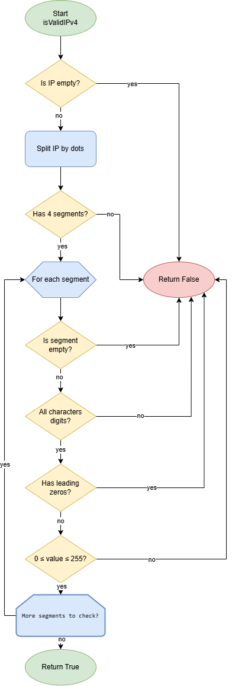

# IPv4 Address Validator
A Kotlin implementation of an IPv4 address validator that ensures strings conform to valid IPv4 format.

## Overview
This validator checks if a given string represents a valid IPv4 address by validating:
- Format (x.x.x.x)
- Segment values (0-255)
- Character validity
- Leading zeros

| Flowchart |
|---|
| 
